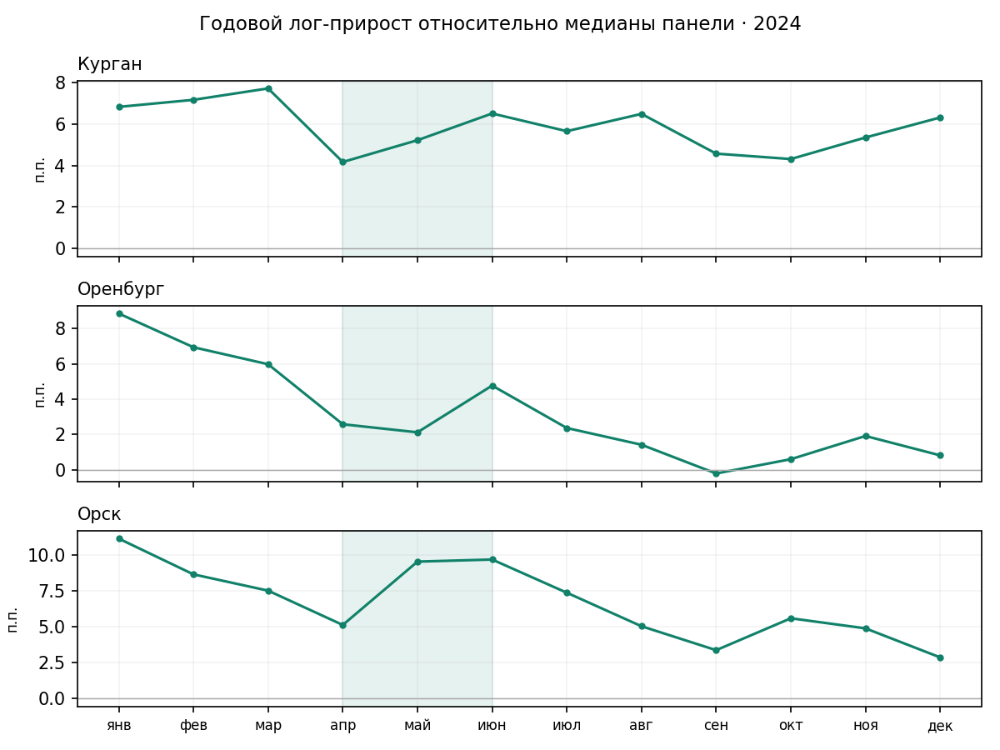

# V5: прогноз потребления и мониторинг

Щеколдин Ярослав Данилович. СберИндекс, номинация «Прогнозирование». 9 октября 2026.

## V5: итоговая исследовательская версия

V5 добавляет длинный национальный сезонный ориентир и сглаживает месячный прогноз.
Проверка использует одинаковые пары прогноз–факт с V4.

| Горизонт | MAE V4, руб. | MAE V5, руб. | Дат выпуска |
|---|---:|---:|---:|
| 1 месяц | 371,44 | 307,85 | 12 |
| 3 месяца | 393,73 | 393,73 | 2 |
| 6 месяцев | 446,59 | 446,59 | 1 |
| 12 месяцев | 784,32 | 650,41 | 1 |

Месячная ошибка снизилась на 17,1%: выигрыш во всех шести категориях и в 9 из 12 месяцев.
При задержке национальных данных на два месяца MAE составляет 307,06 руб.
Годовое улучшение предварительное: доступна одна дата проверки.
Дизайн V5 выбран после просмотра исторических результатов. Это ретроспективная
доработка, независимого будущего теста нет. Исторические версии национальной
выгрузки недоступны, поэтому возможные пересмотры данных не исключены.

Протокол: research/v5/PROTOCOL.md. Построчные результаты: research/v5/results/.
Экспорт 52 560 прогнозов на 2025 год
рассчитан из истории по декабрь 2024. Это исторический экспорт, не прогноз на дату подачи.
Интервалы V5 ещё не откалиброваны. Детектор остаётся confirmed2 из V4.
Методология предыдущих этапов V3 и V4 приведена в соответствующих разделах отчёта.

## Как устроена доработка

Месячный прогноз усредняет V4, панельный сезонный прогноз с текущим общим темпом
и локальную смесь с длинным национальным ориентиром. Годовой прогноз использует
медианное отношение муниципального ряда к национальному ориентиру за три месяца.
Национальная сезонность опирается на значения того же месяца прошлого года и
медиану последних трёх годовых темпов. Будущие наблюдения исключены из признаков.

Источник дополнительного ряда: СберИндекс, «Потребительские расходы», CC BY-SA 4.0.
Официальная выгрузка предоставлена владельцем 09.10.2026; все 292 значения совпали.
Атрибуция: research/v5/SOURCES.json; сверка: research/v5/SOURCE_VERIFICATION.json.

<!-- pagebreak -->

## Границы доказательств V5

Формула выбрана после исследования известной истории и результатов предыдущих итераций. Фактические будущие значения исключены из вычисления признаков,
но сама оценка не является слепым тестом. Неудачные варианты сохранены в метриках
trial01 и trial02. Длинный ряд взят из текущей версии исторической выгрузки,
поэтому отсутствие пересмотров и фактический календарь публикации не доказаны.

Оценка ограничена указанными территориями, категориями и датами. Она не заменяет независимый тест на новых периодах.

Месячная MAE улучшилась во всех шести категориях. Три проигранных месячных выпуска:
февраль, август и сентябрь 2024. Стабильность на двухмесячном лаге не заменяет
проверку на новых годах. Годовой результат предварительный.

Проверки: шесть новых unit-тестов, совпадение фактов с исходным файлом,
уникальность 200 352 ключей, конечность прогнозов, неизменность h=3/6, сверка
всех MAE и подписей исходников. Пересчёт V5 использует сохранённую базу V4.

Интервалы и веб-демо из предыдущего этапа относятся к V3. V5 пока поставляет
точечные прогнозы. Детектор confirmed2 и его отдельные проверки остаются из V4.

<!-- pagebreak -->

# Расширенная годовая проверка

Годовой компонент V5 использует три последних муниципальных месяца и длинный
национальный ряд. Выделение этой формулы позволяет проверить десять дат выпуска
(март–декабрь 2023) на целях ровно через 12 месяцев (март–декабрь 2024).
Это 124 284 пары прогноз–факт при начальной истории 3–12 календарных месяцев.
На прежней дате прогнозы в точности совпали с V5. Шесть дополнительных тестов
проверили длину истории, годовой горизонт и инвариантность к будущим данным.

| Модель | MAE, все 6 категорий, руб. | MAE, «Все категории», руб. |
|---|---:|---:|
| Годовой компонент V5 | 761,46 | 1 888,26 |
| V5, задержка национальных данных 2 месяца | 783,27 | 2 027,07 |
| Последнее наблюдение | 1 331,24 | 4 346,35 |
| Последнее наблюдение × национальный рост | 684,14 | 1 749,54 |

V5 выигрывает у постоянного последнего значения на всех десяти датах, но уступает
простой модели национального роста по средней ошибке. Поэтому выигрыш на одной
единственной дате не подтверждает устойчивого преимущества на годовом горизонте.
Все цели принадлежат 2024 году, окна перекрываются, нового слепого теста нет.
Сопоставимость режимов разной начальной истории требует отдельной проверки.

Дополнительные онлайн-смеси и нелинейные поправки ухудшили часть показателей и
не приняты. Основная V5 сохранена. Код и полные выгрузки отклонённых
экспериментов не включены в комплект сдачи. Годовые проверки
включены в поставку: research/v6/annual_results, annual.py, verify.py и test_annual.py.

<!-- pagebreak -->

# Предыдущие этапы V3 и V4

Ниже сохранена подробная методология предыдущих этапов. Их таблицы относятся
к указанным там выборкам и версиям. Актуальные результаты V5 приведены выше.

Итоговая система сочетает сезонный ориентир, общую для многих рядов модель Ridge, адаптированный Chronos-Bolt и панельный фактор по категориям. На всей доступной панели средняя абсолютная ошибка (MAE) уменьшилась относительно предыдущего ансамбля на 15,0%, 9,8% и 5,4% для горизонтов 1, 3 и 6 месяцев. Разделы 2 и 3 описывают ретроспективную проверку и результаты на отдельных группах территорий.

## Данные и единицы измерения

Источник - СберИндекс: 303 126 наблюдений, 2 190 муниципалитетов, 6 категорий, январь 2023 - декабрь 2024. Всего 13 140 рядов; 12 096 полных и 1 044 неполных. Целевая величина выражена в рублях на среднего жителя, а не в суммарных расходах муниципалитета. «Все категории» нельзя считать суммой остальных пяти категорий.

Пропуски истории заполняются только внутри доступного префикса: перенос предыдущего значения, затем среднее префикса для начальных пропусков. Полностью пустой префикс не превращается в искусственные нули. Отсутствующие фактические цели исключаются одинаково у сравниваемых моделей.

## Архитектура

| Блок | Вход и выход |
|---|---|
| Подготовка | Проверка ключей и календаря; панель МО x категория x месяц |
| Прогноз | История до origin; кандидаты; фиксированная политика выбора |
| Неопределённость | Отдельная калибровочная группа; интервалы вокруг прогноза |
| Мониторинг | Онлайн-остатки и относительная динамика; дата тревоги без переноса назад |
| Интерпретация | Доступные к дате новости; реальные примеры; оговорки |
| Выход | Таблицы прогнозов, метрики, локальное интерактивное демо |

Исторический экспорт V3 содержит 52 560 прогнозных строк: 2 190 МО x 6 категорий x 4 горизонта. Точка прогноза - декабрь 2024; цели - январь, март, июнь и декабрь 2025. Это историческая демонстрация, не прогноз из 2026 года.

<!-- pagebreak -->

## 2. Методика и протокол проверки

Сезонный ориентир масштабирует значение соответствующего месяца предыдущего года по наблюдаемой динамике. Ridge обучается совместно на рядах 500 МО. Признаки включают логарифмические уровни, последние изменения, сезонное значение, годовую динамику, наклон, категорию, горизонт и календарные гармоники. Стандартизация оценивается только на обучающих строках; alpha=100.

Базовый ансамбль V2 выбирает по категории и горизонту сезонную модель, смеси Ridge и сезонной с весами 0/0,25/0,5/0,75/1, адаптированный Chronos или смесь 25% Chronos и 75% сезонной модели. Требуется не менее 2% улучшения MAE на группе выбора (tuning) относительно сезонного ориентира.

Панельное улучшение V3 строит медиану log1p расходов по каждой категории и месяцу. Прогноз общего фактора складывается из сезонного значения и медианного годового прироста за последние 3 или 6 доступных месяцев. Локальная поправка - медиана отклонений МО от фактора за последние 3 месяца. Кандидаты смешивают общий прогноз с локальной сезонной моделью с весом фактора 0,25 или 0,75; дополнительные кандидаты смешивают V2 и панельный прогноз поровну. Для замены V2 также требуется 2% улучшения на tuning. h=12 не выбирается: сохранён затухающий тренд.

## Разбиения и доступность информации

Для выбора используются 50 МО, для калибровки интервалов - 100 других МО, для парного сравнения с Prophet - ещё 100 МО. Исходные 10 пилотных МО выделены отдельно. Отбор по хэшу ID и покрытию первого года; группы не пересекаются. История оцениваемого МО до origin может входить в pooled-обучение: spatial cold-start не заявляется.

Финальные точки отсечения: 12 месяцев для диагностического h=12; 18 месяцев для h=1/3/6; 21 месяц для h=1/3; 23 месяца для h=1. Во всех случаях признаки получают только доступный префикс. Число рядов с неполной историей на этих срезах: 174, 96, 36 и 24 соответственно.

После исключения отсутствующих целей сохранены 87 786 пар прогноз-факт по 2 116 МО. Территориальная группа remaining не участвовала в выборе V3, однако базовые модели ранее считались по всему набору. Все группы используют один календарь 2024 года. Это не нетронутый слепой тест и не новая независимая временная выборка.

Основная метрика MAE = среднее абсолютное отклонение прогноза от факта в рублях. Строки имеют одинаковый вес; крупные по уровню расходов категории могут сильнее влиять на абсолютную ошибку. Поэтому таблицы по категориям и группам сохранены отдельно. R² присутствует в вычислительных таблицах там, где определён; основное заключение строится по MAE.

<!-- pagebreak -->

## 3. Качество прогноза и интервалы

Полная панель включает tuning и calibration; эта таблица описательная. Отрицательное изменение означает снижение MAE.

| Горизонт | Предыдущий ансамбль | Итоговая модель | Изменение MAE |
|---|---|---|---|
| 1 месяц | 366,19 | 311,26 | -15,0% |
| 3 месяца | 436,66 | 393,73 | -9,8% |
| 6 месяцев | 471,87 | 446,59 | -5,4% |
| 12 месяцев | 784,32 | 784,32 | без изменения |

На remaining, не участвовавших в выборе V3:

| Горизонт | Число пар | MAE до | MAE после | Изменение |
|---|---|---|---|---|
| 1 | 33 180 | 370,66 | 315,78 | -14,8% |
| 3 | 22 140 | 442,99 | 400,36 | -9,6% |
| 6 | 11 040 | 478,72 | 454,55 | -5,0% |
| 12 | 10 962 | 789,46 | 789,46 | 0,0% |

Сравнение с Prophet выполнено строго на одинаковых ключах МО, категории, origin и горизонта: всего 3 996 пар. Конфигурация организаторского baseline неизвестна, поэтому ниже наша воспроизводимая reference-модель Prophet, а не заявленное превосходство над скрытым решением организатора.

| Горизонт | Число пар | Итоговая MAE | Prophet MAE |
|---|---|---|---|
| 1 | 1 710 | 295,85 | 715,64 |
| 3 | 1 146 | 356,22 | 969,13 |
| 6 | 570 | 408,23 | 1 131,60 |
| 12 | 570 | 745,22 | 811,71 |

Интервалы номинального уровня 90% калибруются по максимуму нормированных абсолютных ошибок внутри МО/категории/горизонта; нормировщик - среднее доступного префикса. Используется конечновыборочный квантиль ceil((n+1)*0,9). Нижняя граница ограничена нулём. На remaining фактическое покрытие: 94,8%, 92,4%, 87,2%, 89,1% для h=1/3/6/12. Средняя ширина: 1 891,37; 2 175,81; 1 993,49; 3 285,58 руб.

На h=6 покрытие ниже номинального. Обменность территорий и стабильность будущих режимов не доказаны; гарантии 90% на новые месяцы нет. Для h=12 доступен только один origin, поэтому вывод диагностический. Источники таблиц: pipeline/v3_results/comparison.csv, paired_prophet_metrics.csv, interval_metrics.csv.

<!-- pagebreak -->

## 4. Foundation-модель и новости

Используется amazon/chronos-bolt-tiny, закреплённая ревизия a0e552de83495b5c28c14c71c374f3e33280b340. Прогноз выполняется на CPU без дообучения. Из логарифма первого года удаляется линейный наклон, получается центрированный сезонный профиль. Ряд делится на экспоненту профиля; после zero-shot прогноза сезонность восстанавливается. Только наблюдения до origin участвуют в адаптации.

Контролируемая проверка вклада в предыдущий ансамбль, на одинаковой тестовой группе:

| h | Chronos исходный | Адаптированный | Без Chronos | С Chronos |
|---|---|---|---|---|
| 1 | 948,9 | 433,1 | 373,9 | 347,5 |
| 3 | 1 432,3 | 821,5 | 540,6 | 400,0 |
| 6 | 2 756,0 | 1 902,6 | 627,8 | 443,1 |

«Без Chronos» означает замену только выбранных Chronos-компонентов сезонной моделью при остальных неизменных решениях. Это не заново оптимизированный ансамбль без foundation-модели. Адаптация полезна, но самостоятельный Chronos не становится лучшим на каждом горизонте. Неизвестный корпус предобучения не позволяет исключить пересечение с исходными данными. Эти числа относятся к проверке компонента V2, не к итоговому MAE V3.

## Новостной канал

Корпус содержит девять официальных фактов Банка России: начальное состояние ставки декабря 2022 и восемь повышений 2023-2024. Признаки: текущая известная ставка, сумма и число изменений за 90 дней, время с последнего изменения. Дата доступности - день после публикации; используется строгое условие available_at < as_of. Будущие решения не подставляются. Это небольшой вручную проверенный корпус, не универсальный новостной поток и не языковая модель.

Контролируемая ablation на исходном этапе: одна и та же Ridge с новостями и без них, одинаковые фактические цели:

| Горизонт | MAE без новостей | MAE с новостями | Вывод |
|---|---|---|---|
| 1 месяц | 441,83 | 316,43 | улучшение 28,4% |
| 3 месяца | 572,81 | 675,94 | ухудшение 18,0% |
| 6 месяцев | 578,53 | 870,71 | ухудшение 50,5% |

Улучшение на одном горизонте не переносится автоматически на итоговую систему. Для детекторов новости представлены как известный к моменту сигнала контекст, а не как доказанный совместный предиктор. Причинное влияние ставки и реальная способность заранее предсказывать шоки не установлены.

Источники расчётов: pipeline/upgrade_results/metrics.csv, paired_comparisons.json; pipeline/final_results/news_ablation.csv; pipeline/data/news_events.csv.

<!-- pagebreak -->

## 5. Обнаружение изменений

Сравниваются собственные реализации CUSUM, консервативного многомасштабного накопления остатков и панельных детекторов. Панельный сигнал - годовая log1p-динамика относительно медианы категории, нормированная на устойчивый разброс. Окна: 1, 2 или 3 месяца; пороги выбираются на калибровке с ограничением доли контрольных рядов с тревогой не более 5%, затем по F1. CUSUM и multiscale проверяются с ранее зафиксированными порогами 8 и 5.

Полусинтетический тест строится на наблюдаемых рядах категории «Все категории»: отдельно 300 МО калибровки и 300 теста, семь сценариев на МО. Тест содержит 1 500 структурных изменений, 300 контролей и 300 одиночных выбросов. Вставляются сдвиги ±10% и ±20%, а также экспоненциальный тренд с коэффициентом 0,03 в месяц; событие начинается на индексах 15-19. Выброс +30% не считается структурным изменением.

Успех - первая тревога от даты изменения до двух месяцев после него. Ранние и повторные тревоги учитываются как FP. Для панельного метода интервал между тревогами ограничен cooldown=3; у консервативного метода своя ранее зафиксированная политика cooldown. Сравниваются целые политики, не только формулы статистик. Задержка считается только по обнаруженным изменениям.

| Метод | Precision | Recall | F1 | Контроль с тревогой | Задержка, мес. |
|---|---|---|---|---|---|
| CUSUM | 0,684 | 0,347 | 0,460 | 3,7% | 1 |
| Multiscale | 0,903 | 0,243 | 0,383 | 1,3% | 2 |
| Панель, 1 мес. | 0,338 | 0,389 | 0,361 | 1,0% | 0 |
| Панель, 2 мес. | 0,406 | 0,443 | 0,423 | 1,3% | 1 |
| Панель, 3 мес. | 0,459 | 0,415 | 0,436 | 0,7% | 2 |

На этапе V3 выбран multiscale как консервативный режим: высокая точность тревог ценой низкой полноты. Он не лучший по F1; CUSUM в этом тесте имеет больший F1. Панельный метод с окном 3 даёт мало тревог на чистом контроле, но множество FP на остальных сценариях. Поэтому низкий control rate нельзя выдавать за высокую общую precision.

Реальной размеченной базы структурных шоков нет. Полусинтетические вставки позволяют проверить механизм, но не доказывают качество на будущих кризисах. Контекст общего фактора вычисляется по доступному текущему месяцу; система предполагает получение панели без задержки. После задержки публикации фактическое время реакции будет позднее. Дата тревоги никогда не переносится назад.

Источник: pipeline/v3_results/detector_metrics.csv; определения и пообъектные события сохранены рядом. Пороговые решения: detector_policy.json. Параметры базового онлайн-мониторинга: pipeline/upgrade_results/detector_selection.json и upgrade_v2.py.

<!-- pagebreak -->

## 6. Реальные примеры и практический смысл

Для независимого от тревог выбора иллюстраций использованы официальные сообщения МЧС о паводках апреля 2024: Орск, Оренбург и Курган. Список событий зафиксирован до просмотра срабатываний по этим кейсам. Муниципалитеты сопоставлены через официальный territory_id, а не по предположению о числовом коде.

Все три кейса не вызвали тревогу CUSUM, multiscale или панельного метода с окном 3 в проверенном окне. Это отрицательный результат, который сохранён, а не заменён удачными примерами. Относительная годовая log-динамика апреля-июня по сравнению с январём-мартом изменилась примерно на -0,98 п.п. для Орска, -4,10 п.п. для Оренбурга и -1,94 п.п. для Кургана. Это описательные изменения, не оценка причинного эффекта паводка.

Практическое использование: аналитик выбирает муниципалитет и категорию, смотрит фактическую историю, прогноз и диапазон неопределённости, затем проверяет сигнал и доступный к его дате контекст. Отсутствие сигнала не означает отсутствия ущерба; высокая агрегированность и месячная частота могут скрывать локальное событие. Сигнал служит основанием для проверки, не автоматического управленческого решения.

Справочник охватывает все 2 190 ID. Выбрана последняя историческая запись, начинающаяся не позднее 2024 года; устаревшие границы помечены. Дополнительная численная сверка с публичным API расходов не завершилась из-за HTTP 502. Полные даты, ссылки и ограничения: pipeline/v3_results/local_cases.json и pipeline/data/municipality_dictionary_source.json.

<!-- pagebreak -->

## 7. Воспроизводимость и область применимости

Инструкции запуска приведены в README.md. Исходники, протоколы экспериментов и таблицы результатов находятся в pipeline/. Обозначения V1/V2/V3 соответствуют последовательным этапам исследования.

Быстрая проверка: python run.py check. Она проверяет контрольные суммы, запускает 54 unit-теста, сверяет исходники с подписями расчёта, фактические цели, уникальность ключей, конечность прогнозов, MAE, выбор только на tuning, границы интервалов и подсчёты TP/FP/FN. Работа идёт с временной копией, сохранённые доказательства не изменяются.

Полный пересчёт: python run.py reproduce --output ../sberindex-recomputed. Требуется новый каталог вне репозитория. Закреплены Python-зависимости и ревизия весов. Сквозной запуск проверен 9 октября 2026 года: заново рассчитаны 87 786 пар прогноз-факт и 52 560 прогнозных строк экспорта. Выбор моделей и метрики детекторов совпали. Максимальные расхождения итогового прогноза и экспорта составили 0,0013 и 0,0021 руб. соответственно. Протокол с точными допусками и подписями кода: docs/REPRODUCTION_CHECK.json.

## Параметры и выходные файлы

Базовые настройки находятся в final_config.json, настройки подтверждающего этапа - в release_config.json. PARAMETERS.json перечисляет параметры панельной модели и расширенного теста детекторов, зафиксированные в коде. Политики выбора и калибровочные величины сохранены рядом с соответствующими результатами.

Итоговые таблицы находятся в pipeline/v3_results/: comparison.csv содержит сравнение по группам, paired_prophet_metrics.csv - парное сравнение с Prophet, detector_metrics.csv - качество обнаружения изменений. Файл forecast_export.csv.gz содержит прогнозы и границы интервалов. Каталог predictions.parquet читается pandas как единая таблица из четырёх частей.

Область применимости результатов задаёт описанный ретроспективный протокол. Для проверки на будущих периодах нужны новые наблюдения и заранее зафиксированные правила оценки. Ограничения конкретных моделей, новостных признаков и детекторов приведены в разделах 2-6.

<!-- pagebreak -->

## 8. Расширенная проверка: все месячные даты и новый детектор

Дополнительный этап от 9 октября 2026 года. Код, протокол и построчные результаты: research/v4/. Новый расчёт охватывает 375 432 пары по горизонтам 1/3/6/12 и всем датам с историей не короче 12 месяцев. Месячное сравнение с V3 содержит 150 228 одинаковых пар на 12 датах выпуска.

| Вариант месячного прогноза | MAE, руб. | Решение |
|---|---:|---|
| Прежняя политика V3 | 383,62 | База сравнения |
| Новая последовательная смесь | 426,85 | Прямое применение отклонено |
| Защитная смесь с V3 | 371,44 | Улучшение 3,17% на известной истории |

Защитное правило работает отдельно по категориям. Первые три даты используется V3. Затем новая смесь получает вес 50% только при выигрыше не менее 2% на трёх последних уже наблюдавшихся целях. Иначе остаётся V3. Эта вторая итерация дизайна выполнена после просмотра первого расчёта. Политика самого V3 ранее подобрана на известной истории. Результат не является независимым будущим тестом. Диагностический bootstrap по датам даёт разницу MAE [-18,53; -6,15] руб., но 12 последовательных месяцев не обеспечивают надёжной оценки всех будущих режимов.

Новый детектор confirmed2 требует двух последовательных отклонений одного знака от прежнего локального уровня после удаления общего фактора панели. Масштаб задаёт MAD прошлых изменений. Порог 4 выбран на 300 калибровочных МО при ограничении контрольных тревог до 5%. На прежнем тесте F1 составил 0,574 против 0,383 у multiscale.

До дополнительного расчёта порог зафиксирован. Следующие 300 МО в SHA256-порядке и новый seed 20261019 образуют подтверждающую группу. На 2 100 сценариях получены результаты:

| Метод | Precision | Recall | F1 | Контроль с тревогой | Задержка, мес. |
|---|---:|---:|---:|---:|---:|
| Multiscale | 0,898 | 0,271 | 0,416 | 1,00% | 2 |
| CUSUM | 0,667 | 0,369 | 0,476 | 3,00% | 1 |
| Confirmed2 | 0,791 | 0,489 | 0,605 | 1,67% | 1 |

Новый детектор повышает полноту ценой части precision. Задержка относится только к обнаруженным изменениям. Фактор текущего месяца требует наблюдаемой панели. Синтетика проверяет локальный сдвиг одного ряда относительно фиксированного фона, а не общенациональный шок. Предсказание события до появления наблюдений не доказано.

На длинных горизонтах новые факторные варианты проиграли V3. Дополнительный пересчёт Chronos-Bolt-Tiny на всех прежних парах дал годовую MAE 3255,13 без адаптации и 1887,43 с адаптацией против 784,32 у V3. Такие замены отвергнуты. Проверка: python research/v4/verify.py. Полный порядок повторного расчёта приведён в research/v4/README.md.

## Источники и права

СберИндекс: CC BY-SA 4.0. Chronos-Bolt: Amazon, Apache-2.0. Prophet и scikit-learn: внешние библиотеки. CUSUM/EWMA: NIST. Conformal-интервалы: Barber et al. События: Банк России и МЧС. Полная атрибуция и URL: SOURCES.md.

